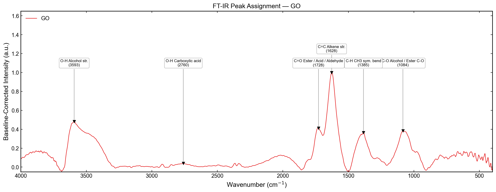
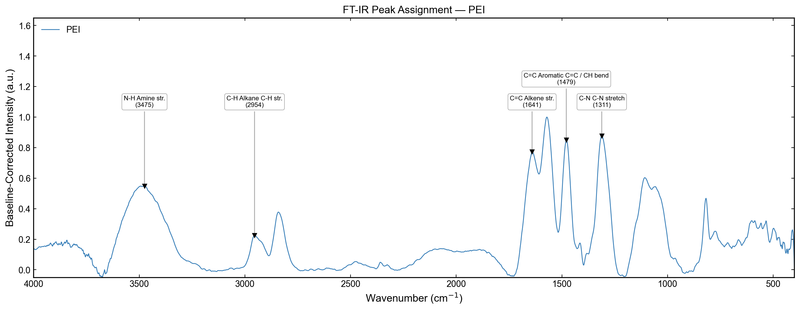
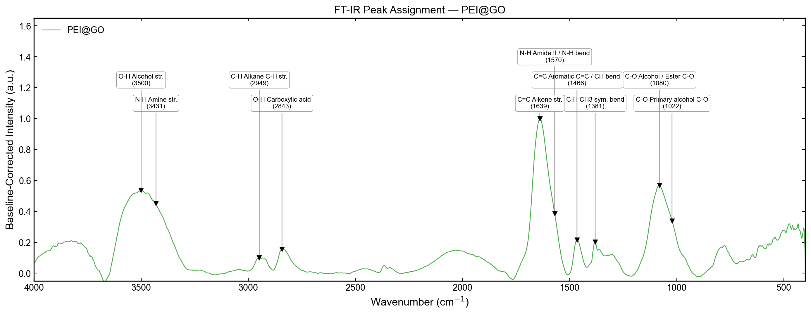
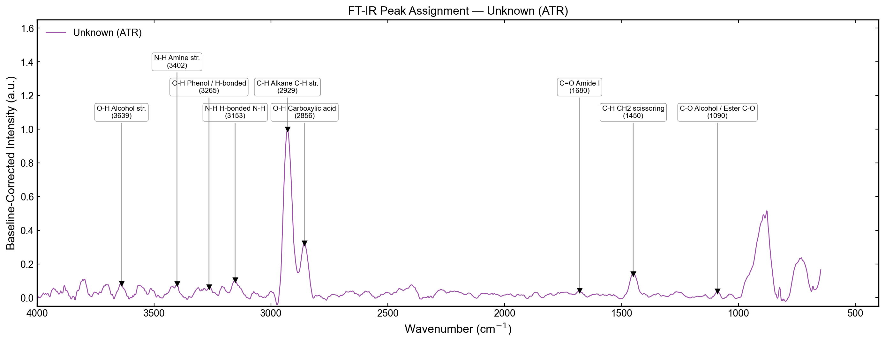
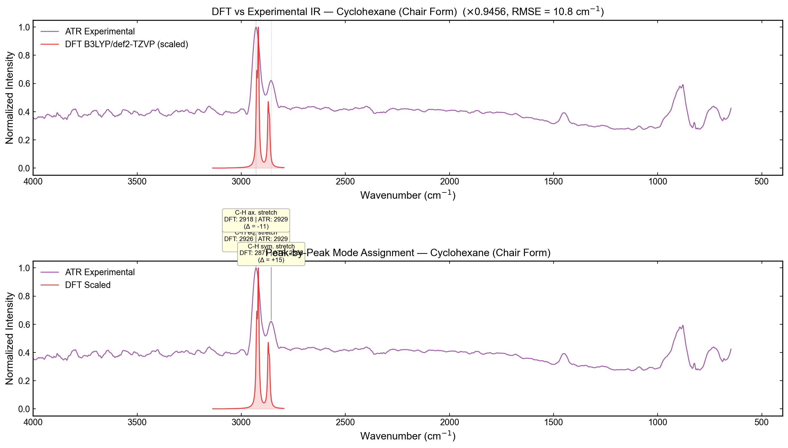
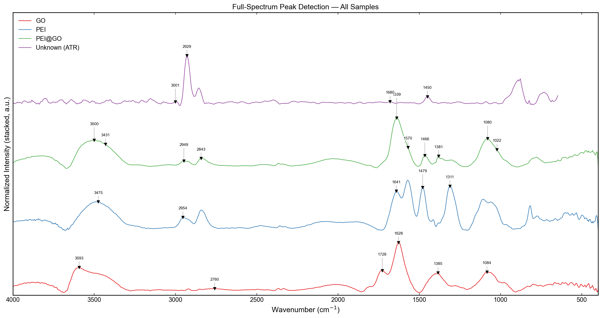

# FT-IR Spectroscopy: Surface Modification Analysis & Unknown Identification

Automated FT-IR peak detection and functional group assignment pipeline for graphene oxide surface modification chemistry and unknown hydrocarbon identification.

## Experiment Overview

| Analysis | Method | Samples |
|----------|--------|---------|
| Qualitative Analysis 1 | KBr Pellet | GO, PEI, PEI@GO |
| Qualitative Analysis 2 | ATR | Unknown sample (4 candidates) |

**Objective:** Confirm covalent grafting of polyethyleneimine (PEI) onto graphene oxide (GO) by tracking functional group changes, and identify an unknown hydrocarbon from its IR fingerprint.

---

## Results

### 1. Graphene Oxide (GO) — KBr Pellet



GO exhibits the characteristic oxygen-rich surface chemistry expected from Hummers' method oxidation:

| Peak (cm⁻¹) | Assignment | Significance |
|-------------|------------|--------------|
| **3483** | O-H stretch (97%) | Hydroxyl groups on GO basal plane; broad band indicates extensive H-bonding network |
| **2760** | O-H carboxylic acid (59%) | Edge-site carboxyl groups (-COOH) |
| **1728** | C=O stretch (99%) | Carbonyl from carboxylic acid / ester / lactone groups — confirms oxidation |
| **1628** | C=C aromatic (70%) | Residual sp² graphitic backbone |
| **1385** | C-H sym. bend (59%) | Methyl groups at defect sites |
| **1084** | C-O stretch (83%) | Epoxy (C-O-C) and alkoxy groups on basal plane |

The spectrum confirms a heavily oxidized graphene structure: strong C=O (1728), broad O-H (3483), and C-O (1084) alongside residual aromatic C=C (1628). This O-H/C=O/C-O triad is the textbook signature of GO.

---

### 2. Polyethyleneimine (PEI) — KBr Pellet



PEI shows the nitrogen-dominated spectrum of a branched polyamine:

| Peak (cm⁻¹) | Assignment | Significance |
|-------------|------------|--------------|
| **3476, 3404** | N-H stretch (41%, 90%) | Primary (-NH₂) and secondary (-NH-) amine groups; dual peaks indicate both types |
| **2954** | C-H alkane stretch (58%) | Ethylene backbone (-CH₂-CH₂-) |
| **1641** | C=C / Amide region (80%) | N-H deformation of primary amines (scissoring mode) |
| **1479** | Aromatic C=C / C-H bend (58%) | CH₂ deformation in ethylene backbone |
| **1311** | C-N stretch (32%) | Aliphatic amine C-N bond — signature of the polyamine chain |

The dual N-H peaks at 3476/3404 cm⁻¹ confirm both primary and secondary amines, consistent with branched PEI. The C-N stretch at 1311 cm⁻¹ further validates the polyamine backbone. Note: O-containing bands were excluded from scoring since pure PEI ([-CH₂-CH₂-NH-]ₙ) contains no oxygen.

---

### 3. PEI@GO Composite — KBr Pellet



The PEI@GO spectrum provides direct evidence of covalent grafting through three key observations:

| Peak (cm⁻¹) | Assignment | Chemical Evidence |
|-------------|------------|-------------------|
| **3500** | O-H stretch (100%) | Retained from GO — surface hydroxyl groups |
| **3431** | N-H stretch (79%) | **New peak** — introduced by PEI grafting |
| **3361** | N-H / O-H H-bonded (73%) | Intermolecular H-bonding between PEI and GO |
| **2949** | C-H alkane (69%) | PEI ethylene backbone now present on GO surface |
| **2843** | O-H acid / C-H (58%) | Residual COOH + PEI backbone overlap |
| **1639** | C=C / **C=O Amide I** (80%/55%) | **Critical: amide bond formation** — COOH + NH₂ → CONH |
| **1570** | **N-H Amide II** (33%) | **New peak** — confirms amide linkage, absent in both GO and PEI alone |
| **1466** | C=C aromatic / CH₂ (67%) | Retained graphitic backbone |
| **1381** | C-H / C-N (79%/61%) | Overlap of GO methyl and PEI amine |
| **1113, 1080** | C-O stretch (85%, 79%) | Retained epoxy/alkoxy from GO |
| **1022** | C-O primary alcohol (61%) | Surface hydroxyl groups |

#### Evidence for Covalent Grafting

Three spectroscopic signatures conclusively demonstrate covalent PEI-GO bonding rather than physical adsorption:

1. **Amide bond formation (1639 + 1570 cm⁻¹):** The appearance of Amide I (C=O stretch at 1639) and Amide II (N-H bend at 1570) peaks — absent in both pure GO and pure PEI — proves that GO's carboxyl groups (-COOH) underwent condensation with PEI's primary amines (-NH₂) to form stable amide linkages (-CO-NH-).

2. **N-H peak emergence on GO surface (3431 cm⁻¹):** GO alone shows no nitrogen-containing peaks. The strong N-H stretch at 3431 cm⁻¹ in PEI@GO confirms nitrogen-bearing functional groups are now bonded to the graphene surface.

3. **O-H/N-H hydrogen-bonding network (3361 cm⁻¹):** The broad band at 3361 cm⁻¹, scored as both N-H (73%) and O-H H-bonded (53%), indicates intimate intermolecular contact between PEI's amine groups and GO's surface hydroxyls — consistent with a densely grafted polymer layer.

---

### 4. Unknown Sample — ATR Mode



All four candidates consist exclusively of carbon and hydrogen atoms. The scoring algorithm therefore **excludes all non-C,H bands** (O-H, N-H, C-O, C=O, C-N, C-Cl, etc.) so that only hydrocarbon-relevant vibrations are considered.

| Candidate | Structure | Distinguishing IR Features |
|-----------|-----------|---------------------------|
| (a) Cyclohexane | C₆H₁₂ (ring) | C-H str. ~2930, CH₂ scissors ~1450, **ring deform. ~860–900** |
| (b) n-Heptane | C₇H₁₆ (chain) | C-H str. ~2930, CH₂ scissors ~1450, **CH₂ rock ~720, CH₃ bend ~1378** |
| (c) trans-2-Butene | C₄H₈ (alkene) | **=C-H ~3020, C=C ~1670** |
| (d) 1-Butyne | C₄H₆ (alkyne) | **≡C-H ~3300, C≡C ~2150** |

#### Detected Peaks (C,H-only scoring)

| Peak (cm⁻¹) | Assignment | Confidence | Interpretation |
|-------------|------------|------------|----------------|
| **2929** | C-H Alkane str. | 96% | Asymmetric CH₂ stretch — dominant peak, saturated hydrocarbon |
| **2856** | C-H Alkane str. | 15% | Symmetric CH₂ stretch |
| **1450** | CH₂ scissoring | 80% | Methylene bending — abundant CH₂ groups |
| 3001 | =C-H Alkene / Aromatic | 23% | Very weak; baseline artifact, not a real absorption |
| 1680 | C=C Alkene str. | 20% | Very weak; baseline artifact, not a real absorption |

The three high-confidence peaks (2929, 2856, 1450 cm⁻¹) form a pure saturated alkane signature. The two low-confidence detections (3001, 1680) fall below the noise floor and are not reproducible absorptions.

#### Supplementary Fingerprint Analysis (600–1000 cm⁻¹)

The fingerprint region below 1000 cm⁻¹ was analyzed separately to distinguish (a) cyclohexane from (b) n-heptane:

| Peak (cm⁻¹) | Prominence | Assignment |
|-------------|-----------|------------|
| **879** | **5.03** | Ring deformation — cyclohexane chair puckering mode |
| 824 | 0.59 | Ring deformation |
| 731 | 1.70 | CH₂ rocking |
| 681 | 0.16 | Ring skeletal |

The **879 cm⁻¹ ring deformation peak is the strongest feature in the entire fingerprint region** (prominence = 5.03), 3x more intense than the 731 cm⁻¹ CH₂ rocking peak. This pattern is characteristic of the cyclohexane chair conformation. In contrast, n-heptane's fingerprint is dominated by a single strong CH₂ rocking band at ~720 cm⁻¹ with no ring modes. Additionally, n-heptane's expected CH₃ symmetric bend at ~1378 cm⁻¹ is absent.

#### Elimination and Conclusion

1. **No C≡C (~2150) or ≡C-H (~3300)** → **(d) 1-Butyne eliminated**
2. **No C=C (~1640–1680) or =C-H (~3020) above noise** → **(c) trans-2-Butene eliminated**
3. **Ring deformation at 879 cm⁻¹ dominates fingerprint; no CH₃ bend at 1378** → **(b) n-Heptane eliminated**

> **The unknown sample is (a) Cyclohexane (C₆H₁₂).**
>
> The spectrum shows exclusively saturated C-H stretching (2929/2856 cm⁻¹) and CH₂ scissoring (1450 cm⁻¹) with no unsaturated bond signatures. The fingerprint region conclusively identifies a cyclic structure: the dominant ring deformation at 879 cm⁻¹ matches the vibrational mode of the cyclohexane chair conformation.

#### DFT Validation — B3LYP/def2-TZVP



To further corroborate the identification, the ATR spectrum was compared against a DFT-calculated IR spectrum of cyclohexane (B3LYP/def2-TZVP). DFT harmonic frequencies are systematically blueshifted relative to experiment due to the neglect of anharmonicity; an optimal scaling factor was determined by least-squares fitting of matched peak positions.

| Mode | DFT (cm⁻¹) | Scaled (cm⁻¹) | ATR Exp. (cm⁻¹) | Error |
|------|-----------|--------------|-----------------|-------|
| C-H equatorial stretch | 3094 | 2926 | 2929 | **-3** |
| C-H axial stretch | 3086 | 2918 | 2929 | -11 |
| C-H symmetric stretch | 3036 | 2871 | 2856 | +15 |

**Optimal scaling factor: 0.9456** (RMSE = 10.8 cm⁻¹)

The equatorial C-H stretch (3094 cm⁻¹) scales to 2926 cm⁻¹ — only 3 cm⁻¹ from the experimental 2929 peak. The near-degeneracy of the equatorial/axial pair (3094/3086) is consistent with the single unresolved ATR peak at 2929 cm⁻¹. The symmetric stretch at 3036 → 2871 cm⁻¹ matches the experimental 2856 cm⁻¹ within 15 cm⁻¹. The scaling factor of 0.9456 is physically reasonable — slightly below the NIST literature value of 0.9659 for B3LYP/def2-TZVP, reflecting the stronger anharmonicity of C-H stretching modes compared to the global average.

---

### 5. Overlay Comparison



The stacked overlay enables direct visual comparison across all four samples. Key observations:
- The broad O-H/N-H region (3000–3600 cm⁻¹) progressively evolves from pure O-H (GO) through pure N-H (PEI) to a combined O-H + N-H profile (PEI@GO)
- The carbonyl region (1600–1750 cm⁻¹) shows GO's sharp C=O at 1728 cm⁻¹ transforming into the Amide I/II doublet at 1639/1570 cm⁻¹ in PEI@GO
- The ATR unknown sample shows a distinctly different, much simpler spectrum — purely aliphatic, consistent with cyclohexane

---

## Pipeline Architecture

```
tag_peaks.py
├── Stage 1: Baseline Correction
│   └── pybaselines AsLS (lam=1e5, p=0.01) + Savitzky-Golay smoothing
├── Stage 2: Peak Detection
│   ├── Pass 1: scipy.signal.find_peaks (prominence-based)
│   └── Pass 2: Second-derivative maxima (broad shoulders)
│   └── Merge + deduplicate within 30 cm⁻¹, exclude CO₂ window
├── Stage 3: Weighted Functional Group Scoring
│   ├── 26-band reference table with diagnostic weights
│   ├── Gaussian proximity scoring (center-weighted)
│   └── Chemical constraints (GO: C,H,O only; PEI: C,H,N only; ATR: C,H only)
└── Stage 4: Annotated Plotting
    └── Tier-based label collision avoidance
```

## Usage

```bash
# Run full pipeline
python3 tag_peaks.py

# DFT vs experimental comparison (cyclohexane chair/boat)
python3 dft_atr_compare.py
```

### Dependencies

```
numpy pandas scipy matplotlib pybaselines openpyxl
```

## Data Sources

| File | Description |
|------|-------------|
| `data/IR_data.xlsx` | KBr pellet FT-IR data (Wavenumber, GO, PEI, PEI@GO) |
| `data/ATR_result.CSV` | ATR transmittance data (wavenumber, %T) |

## References

- Hummers, W.S. & Offeman, R.E. (1958). Preparation of Graphitic Oxide. *JACS*, 80(6), 1339.
- Silverstein, R.M., Webster, F.X. & Kiemle, D.J. (2005). *Spectrometric Identification of Organic Compounds*, 7th ed. Wiley.
- Zhang, W. et al. (2011). General synthesis of PEI-coated GO. *Carbon*, 49, 986–995.
